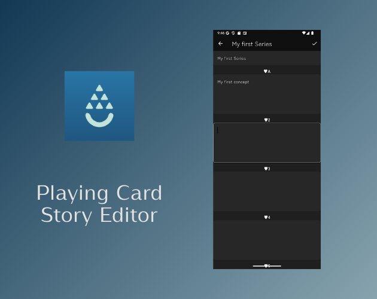

# Cycad

Cycad is a playing card deck editor app, specifically designed for story-driven physical games. It is the successor to [Forge](https://github.com/zzlazo/forge).

While the original Forge used local storage, Cycad has been migrated to a server-side architecture, Supabase, to enable reliable data management.

Cycad is built for:

- Managing Narrative Events: Creating and organizing story branches or random encounters.
- Physical games: Randomly selecting battles, NPCs, or plot twists for a more dynamic experience.
- Campaign Tracking: Keeping the flow of your game organized and accessible.

## Features

Currently, the following functions are available:

- Card Customization: Edit card text and colors to match your game's world.
- Image Export: Export your custom cards as images for use in digital tools or printing.
- Activity Logging (New!): Record logs of your gameplay sessions and story progress.

## Prerequisites

You can use this app by setting up your own Supabase environment. Please configure your API keys in the environment variables.

## Project Structure

This repository is a monorepo organized as follows:

- `app/`: The Flutter-based client application for Android.
- `supabase/`: Contains the backend configuration, including SQL database schemas.

## License

This app is released under the MIT license. For more information, see LICENSE.md
