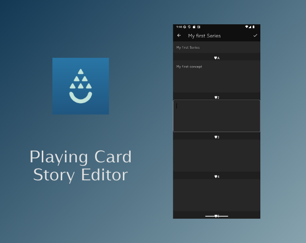
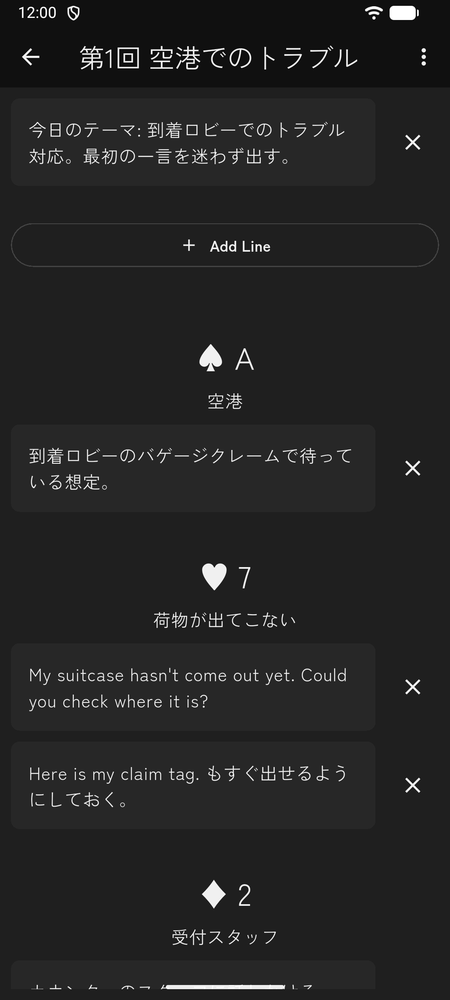
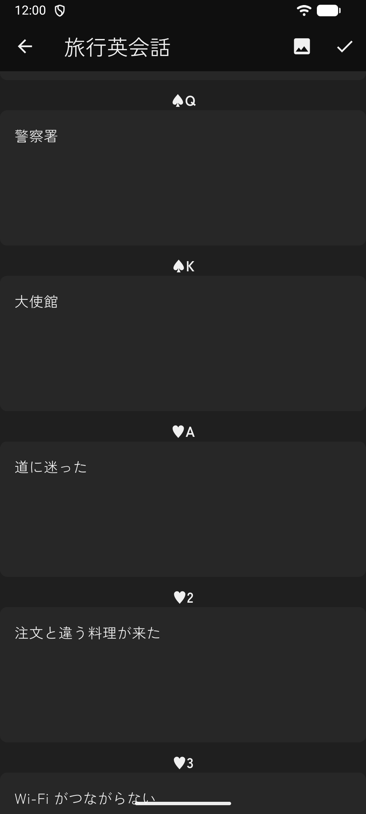
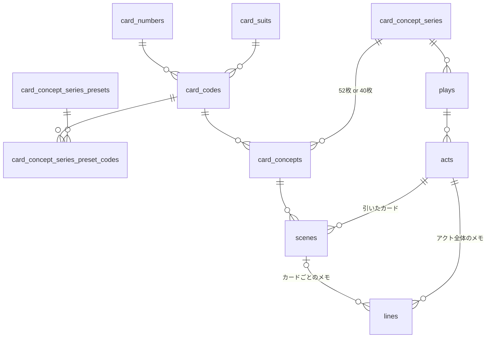
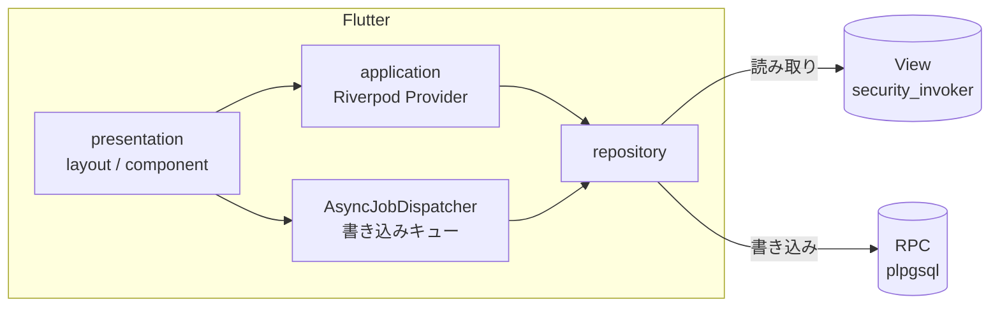

# Cycad



トランプ52枚それぞれに自分で決めた「お題」を割り当て、ランダムに引いた組み合わせで練習や記録ができる Android アプリです。
カスタマイズしやすい単語帳のようなものを目指しました。

たとえば語学練習なら、♠ に「場所」、♥ に「トラブル」を割り当てておき、「♠A 空港」×「♥7 荷物が出てこない」を引いたら、その場面を英語で乗り切る練習をしてメモを残す、という使い方をします。

ローカル保存だった前作 [Forge](https://github.com/zzlazo/forge) の後継で、データ管理を Supabase に移しました。

## スクリーンショット

| プレイの記録 | シリーズの編集 |
|:---:|:---:|
|  |  |
| 引いたカードの組み合わせで場面を作り、<br>カードごとにメモを残す | ♠ は場所、♥ はトラブルのように、<br>スートごとにお題を割り当てる |

## 主な機能

- **シリーズ（デッキ）の作成・編集**: プリセット（52枚 / 1〜10の40枚）を選び、カードごとにお題を入力する
- **画像の書き出し**: 作ったカードを画像にして共有する
- **プレイの記録**: シリーズからカードを引き、引いたカード（シーン）ごとにメモ（ライン）を書き残す

## 技術スタック

| 分類 | 採用技術 |
|---|---|
| クライアント | Flutter 3.38（fvm で固定）/ Android |
| 状態管理 | Riverpod（riverpod_generator）、flutter_hooks |
| ルーティング | go_router、go_router_builder |
| モデル | freezed、json_serializable |
| バックエンド | Supabase（PostgreSQL、Auth のメール OTP） |

### 選定理由

- **Riverpod**: 使い慣れており、Provider 間の依存をコード生成で型安全に書けるため
- **go_router_builder**: ルートとパラメータを型で表現でき、画面遷移時の引数の渡し間違いをコンパイル時に防げるため
- **freezed**: モデルをイミュータブルに保てることと、`copyWith` や JSON 変換を手で書かずに済むため

## 設計

### データモデル


```mermaid
erDiagram
  card_suits ||--o{ card_codes : ""
  card_numbers ||--o{ card_codes : ""
  card_concept_series_presets ||--o{ card_concept_series_preset_codes : ""
  card_codes ||--o{ card_concept_series_preset_codes : ""
  card_concept_series ||--o{ card_concepts : "52枚 or 40枚"
  card_codes ||--o{ card_concepts : ""
  card_concept_series ||--o{ plays : ""
  plays ||--o{ acts : ""
  acts ||--o{ scenes : "引いたカード"
  card_concepts ||--o{ scenes : ""
  acts ||--o{ lines : "アクト全体のメモ"
  scenes |o--o{ lines : "カードごとのメモ"
```

- **カードの定義とお題を分離**: スート × 数字の組み合わせ（`card_codes`）は共通のマスタにし、ユーザーが作るのは「どのカードに何のお題を割り当てるか」（`card_concepts`）だけにしています。プリセットも `card_codes` の組み合わせとして定義しているため、40枚のデッキなども同じ仕組みで扱えます
- **シーンとラインを分離**: 引いたカード（シーン）と、それに対するメモ（ライン）を別テーブルにしました。今後シーンに画像などの要素を追加するとき、内容を細かく分割できるほうが整理しやすいと考えたためです。ラインは `scene_id` を持たなければアクト全体のメモとして扱います
- **ID は UUID**: アプリ側で ID を生成してから保存できる設計にしたかったことと、将来バックエンドを移行してもつまずきにくくするためです（詳細は後述）

### レイヤ構成


```mermaid
flowchart LR
  subgraph app[Flutter]
    P[presentation<br/>layout / component] --> A[application<br/>Riverpod Provider]
    P --> Q[AsyncJobDispatcher<br/>書き込みキュー]
    A --> R[repository]
    Q --> R
  end
  R -- 読み取り --> V[(View<br/>security_invoker)]
  R -- 書き込み --> F[(RPC<br/>plpgsql)]
```

機能ごとに `feature/<機能名>/` 以下を `repository`（Supabase との通信）・`application`（Provider）・`presentation`（画面と部品）に分けています。

### DB アクセス: 読み取りはビュー、書き込みは RPC

- **読み取り**: ネストした JSON を組み立てるビューを用意し、画面に必要な形で1回で取得します。ビューは `security_invoker = on` にして、呼び出したユーザーの権限で評価されるようにしています
- **書き込み**: すべて RPC（PostgreSQL の関数）経由にしました。1つの操作で複数のテーブルを更新する処理（例: アクト作成時に最初のラインも作る、ラインを更新したらアクトとプレイの更新日時も進める）を、1回の通信で済ませるためです
- **アクセス制御**: RLS で、自分が作成した行だけを読み書きできるようにしています。外部キーの検査は RLS を通らないため、書き込み時は親（例: アクトに対するプレイ）も自分のものかを確かめ、他人のデータの下に行を作れないようにしています。RPC は呼び出したユーザーの権限で動くため、RPC 経由の操作にも同じ制御が効きます

### 書き込みキューによる通信の最適化

プレイ画面では、ラインの追加・編集・削除のような細かい書き込みが短い間隔で積み重なります。1操作ごとに通信を待たせると操作感が悪くなるため、次のような仕組みにしました。

1. 新しいラインの ID はアプリ側で UUID として生成する
2. サーバの応答を待たずに、画面の状態を先に更新する
3. 書き込み処理は `AsyncJobDispatcher`（`core/application/service/async_job_dispatcher.dart`）のキューに積み、1件ずつ順番に実行する

キューはジョブの種類（取得 / 変更）とジョブごとの指定から全体のローディング表示の要否を集計し、失敗したときはエラーメッセージを共通のエラーダイアログに流します。
各画面はジョブを積むだけで、ローディングやエラー表示を個別に実装する必要がありません。キューによる処理を学びたかったことも、この仕組みを作った動機です。

## 開発の経緯と振り返り

### ID を bigint から UUID へ移行

当初はシリーズとお題の ID を連番（bigint）にしていましたが、アプリ側で ID を生成してから保存できるように UUID へ移行しました。

このとき DB だけを先に移行し、アプリとリポジトリの SQL の追従が後回しになったことで、シリーズ作成時に返り値の型が合わないエラーが起きていました。
DB に直接加えた変更がリポジトリに残っておらず、どちらが正しい状態なのかを後から突き合わせる必要がありました。スキーマの変更はマイグレーションとして管理し、リポジトリを正とするべきだったと考えています。

### AI の利用について

設計と初期実装はすべて手で書きました。その後、時間が取れず残っていたバグの修正（上記の UUID への追従など）に AI（Claude Code）を利用しています。

## 今後の課題

- **テスト**: まだ書けていません。Repository のモックを使った Provider のテストと、RPC のテストから整備したいと考えています
- **マイグレーション管理**: SQL を手動で実行する運用のため、Supabase CLI のマイグレーションへ移行する
- **楽観的更新の失敗時の巻き戻し**: 書き込みが失敗したときに画面の状態が元に戻らない不具合があります
- **プレイ名の変更**: API はありますが、画面からの導線がありません

## セットアップ

### 1. Supabase

1. [Supabase](https://supabase.com/) でプロジェクトを作成する
2. `supabase/template/db/public/` 以下の SQL を、ディレクトリ名とファイル名の番号順に実行する（`01_schema` → `02_view` → `03_rpc` → `04_seed`）
3. デモ用データを入れる場合は、アプリで一度サインインしてから `05_demo/01_demo_data.sql` の `v_email` を書き換えて実行する

### 2. アプリ

[fvm](https://fvm.app/) で Flutter のバージョンを固定しています。

```bash
cd app
fvm install
```

`app/.env` を作成し、Supabase の接続情報を設定します。

```properties
SUPABASE_URL=
SUPABASE_KEY=
```

`app/android/local.properties` にアプリケーション ID と署名情報を設定します。デバッグビルドだけなら署名の値は空で構いません（`appId` は必須）。

```properties
appId=
storePassword=
keyPassword=
keyAlias=
storeFile=
```

コードを生成してから起動します。

```bash
fvm dart run build_runner build -d
fvm flutter run --dart-define-from-file=.env
```

## ディレクトリ構成

- `app/`: Flutter の Android アプリ
- `supabase/`: スキーマ、ビュー、RPC、シード、デモ用データの SQL

## ライセンス

MIT License。詳しくは [LICENSE.md](LICENSE.md) を参照してください。
